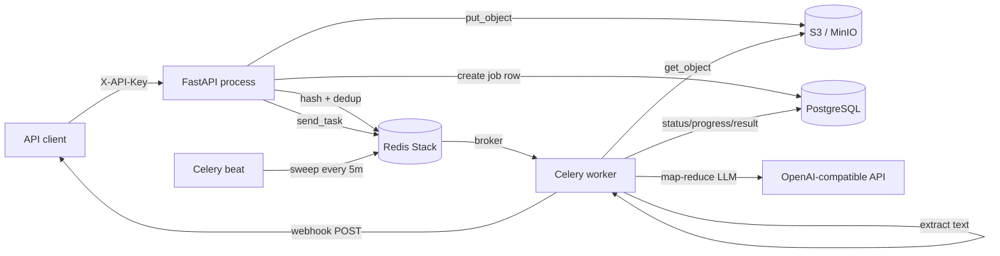
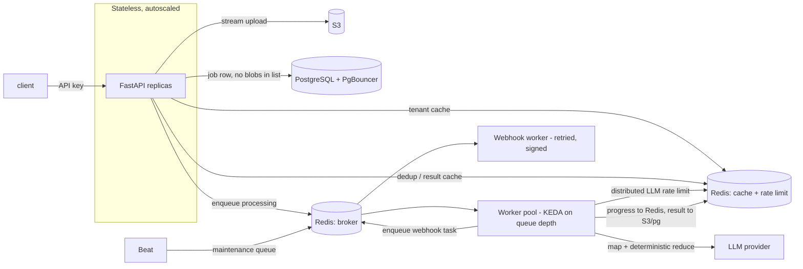

# DocFlow API — Architecture Redesign for Scale

This document reviews the current DocFlow architecture, catalogs the concrete
issues that limit scale, reliability, and cost-efficiency, and proposes a
phased redesign. Every finding points at a real file and line so it can be
acted on directly. Nothing here changes runtime behavior on its own; it is a
plan you can adopt in whole or in part.

---

## 1. Current architecture (as-is)

**Flow.** A tenant authenticates with a hashed API key, uploads a file, and the
API validates it, computes a SHA-256 hash, checks a Redis Bloom filter for
duplicates, uploads the bytes to S3, writes a `jobs` row, and enqueues a Celery
task. A worker downloads the file, extracts text (pypdf / Tesseract / docx),
runs an LLM map-reduce, writes the result back to Postgres, and optionally posts
a webhook. Beat periodically re-queues stuck jobs and prunes expired tokens.

**What is already good.** The reliability layer is thoughtful: an AI-outage
circuit breaker, retry with backoff, a stuck-job sweeper, `json-repair` salvage,
and bounded map-reduce merging. Auth is solid: Argon2 for passwords, SHA-256 for
high-entropy API keys, session versioning, and SSRF protection on webhooks. The
module layout is clean and testable.

The problems below are about **scale**, not correctness of the happy path.

---

## 2. Findings, grouped by theme

Severity: **P1** limits throughput or correctness under load; **P2** raises cost
or operational risk; **P3** is hygiene.

### 2.1 Database — the first bottleneck

| # | Severity | Finding | Location |
|---|----------|---------|----------|
| D1 | P1 | **Listing loads heavy JSONB blobs.** `list_jobs_for_tenant` does `select(Job)`, pulling `result` and `extraction_schema` for every row. A page of 100 completed jobs drags 100 full result payloads into memory and over the wire. | `api/src/jobs/crud.py:60`, `api/src/routers/jobs.py:151` |
| D2 | P1 | **Missing indexes on hot paths.** Only `correlation_id` and `file_hash` are indexed. Listing filters `tenant_id` and orders by `created_at desc`; the sweeper filters `status` + `created_at`. Both do sequential scans as the table grows. | `api/src/jobs/models.py` |
| D3 | P2 | **Schema created two ways.** `lifespan` calls `Base.metadata.create_all` while Alembic also owns the schema. In production these drift; startup should not mutate schema. | `main.py:26`, `api/src/database/postgres_client.py` |
| D4 | P2 | **Two engines, untuned pools, SQL echo.** A sync and an async engine are both built at import with default pool sizes and `echo=True` in development. Many workers × default pool exhausts Postgres connections; echo floods logs. | `api/src/database/postgres_client.py:20-27` |
| D5 | P3 | **Unbounded `result` growth.** Large extraction results live inline in the row, bloating the table and every `SELECT *`. | `api/src/jobs/models.py:27` |

### 2.2 Request path — memory and per-request DB load

| # | Severity | Finding | Location |
|---|----------|---------|----------|
| R1 | P1 | **Whole upload buffered in the API process.** `await file.read()` loads the entire file into memory before hashing and uploading. Concurrent large uploads spike API memory and block. No max-size guard. | `api/src/routers/jobs.py:73` |
| R2 | P1 | **A Postgres round-trip on every authenticated request.** `get_current_tenant` queries `tenants` by key hash on each call. At scale this is the most frequent query in the system and is trivially cacheable. | `api/src/dependencies.py:21` |
| R3 | P2 | **A new boto3 client per S3 call.** `_client()` rebuilds the client (and its connection pool) on every upload and download. | `api/src/services/storage.py:14` |
| R4 | P2 | **Rate limiting keyed by IP, stored in-process.** `get_remote_address` punishes shared-NAT clients and ignores tenants; slowapi's default in-memory store is not shared across API replicas, so the limit multiplies by replica count. | `api/src/rate_limit.py`, `api/src/routers/jobs.py:38` |

### 2.3 Worker and queue

| # | Severity | Finding | Location |
|---|----------|---------|----------|
| W1 | P1 | **No idempotency against redelivery.** With `acks_late=True`, a task can be redelivered after a worker crash. Only `COMPLETE` is guarded; a job already `PROCESSING` can be picked up twice and run concurrently. | `api/src/tasks/process_job.py:96-108` |
| W2 | P1 | **Poison jobs re-queue forever.** The sweeper re-enqueues any `PENDING`/`QUEUED_AI_OUTAGE` job older than the cutoff. `enqueue_attempts` is incremented but never used as a ceiling, so a job that never reaches a worker loops every 5 minutes indefinitely. | `api/src/tasks/sweep_pending_jobs.py:40-70` |
| W3 | P1 | **Per-chunk Postgres writes for progress.** `update_progress` commits to Postgres on every chunk and merge step. A large document doing hundreds of chunks generates hundreds of writes per job; ephemeral progress does not belong in the primary store. | `api/src/tasks/process_job.py:117-146` |
| W4 | P2 | **`asyncio.run` per job with a module-global async client.** `AsyncOpenAI` is created at import (`llm.py:22`) but each task spins a fresh event loop via `asyncio.run`. The client's underlying httpx pool is bound to whatever loop first used it; reusing it across loops is fragile and forfeits connection reuse. | `api/src/tasks/process_job.py:150`, `api/src/services/llm.py:22` |
| W5 | P2 | **One queue for everything.** Processing and maintenance sweeps share `default`. A burst of large jobs starves the sweeps that are supposed to rescue stuck work. | `api/src/tasks/celery_app.py` |

### 2.4 LLM pipeline — cost and latency

| # | Severity | Finding | Location |
|---|----------|---------|----------|
| L1 | P1 | **Token estimate is 1 char = 1 token, ~4× too conservative.** `CHARS_PER_TOKEN = 1` makes `estimate_tokens` return the character count, so the content budget fills roughly four times too early and the document is split into ~4× more chunks than necessary. Every extra chunk is an extra paid LLM call plus reduce-phase merges. This is the single biggest cost lever. | `api/src/services/llm_limits.py:6` |
| L2 | P2 | **Reduce phase always uses the model.** Merging structured partials is done by an LLM call per group per round. For list- or dict-shaped schemas, a deterministic merge (concatenate lists, union keys) is correct, free, and instant; the model should be the fallback, not the default. | `api/src/services/llm.py:159-210` |
| L3 | P2 | **Concurrency limits are per-process.** `MAP_PHASE_MAX_CONCURRENCY` is an in-process `asyncio.Semaphore`. Across N workers the real provider concurrency is N × 5, so provider rate limits are hit unpredictably. A distributed limiter (Redis token bucket) is needed for fair, global throttling. | `api/src/services/llm.py:33-34` |
| L4 | P3 | **No result cache.** The Bloom filter detects duplicate uploads but identical `(file_hash, schema)` inputs are still re-extracted from scratch. Caching completed results avoids paying twice. | `api/src/routers/jobs.py:77-90` |

### 2.5 Reliability and multi-tenancy

| # | Severity | Finding | Location |
|---|----------|---------|----------|
| M1 | P2 | **Bloom filter is global and never reserved.** `docflow_pdf_bloom` is one filter shared by all tenants, auto-created with default capacity/error rate. As it fills, false positives rise; per-tenant correctness relies entirely on the DB re-check. It is also unbounded and non-rotatable. | `api/src/routers/jobs.py:79-90` |
| M2 | P2 | **Circuit-breaker trip is racy and has no half-open state.** `incr` is atomic but the read-threshold-then-trip sequence is not, and recovery is a hard timeout rather than a probed half-open. Multiple workers can trip simultaneously. | `api/src/tasks/process_job.py:52-73` |
| M3 | P2 | **Webhook delivery is inline and single-shot.** Delivery runs inside the processing task; a failure is only logged to `error_log`, never retried, and the payload is unsigned. | `api/src/tasks/process_job.py:171-185`, `api/src/services/webhook.py` |

### 2.6 Observability and ops

| # | Severity | Finding | Location |
|---|----------|---------|----------|
| O1 | P2 | **Sentry is a dependency but never initialized; no metrics.** There is no queue-depth, job-latency, token-usage, or breaker-state signal, so scale problems are invisible until they page someone. | `requirements.txt`, absent init |
| O2 | P3 | **Health check does not check dependencies.** A useful readiness probe verifies Postgres, Redis, and S3 reachability. | `api/src/routers/health.py` |
| O3 | P3 | **Secrets committed in `docker-compose.yml`.** Fine for local, but the file invites copy-paste into shared environments. | `docker-compose.yml` |

---

## 3. Target architecture (to-be)

Guiding principles:

1. **Keep the primary store cold on hot paths.** Ephemeral state (progress,
   tenant lookups, rate counters, breaker) lives in Redis; large payloads
   (results, uploads) live in S3; Postgres holds the durable job record and is
   read with only the columns a path needs.
2. **Make every stage independently scalable.** Stateless API replicas,
   worker pools that autoscale on queue depth, and separate Redis roles so one
   workload cannot starve another.
3. **Spend model tokens deliberately.** Accurate budgeting, deterministic
   merges, distributed rate limiting, and a result cache.
4. **Fail safely and visibly.** Idempotent processing, capped retries with a
   dead-letter path, and real metrics.

---

## 4. Phased roadmap

Each phase is independently shippable and ordered by value-to-risk.

### Phase 1 — Low-risk quick wins (days)

These are localized, testable, and high-leverage.

- **L1 — Fix the token ratio.** Set `CHARS_PER_TOKEN` to ~4 (or use `tiktoken`
  for the configured model). Expect a roughly 4× reduction in chunk count and
  LLM spend on large documents. **Note:** `tests/test_llm_helpers.py::
  test_estimate_tokens_uses_configured_ratio` asserts the 1:1 output and must be
  updated in the same change — it currently pins the inefficiency.
- **D2 — Add indexes.** New Alembic migration for composite
  `(tenant_id, created_at desc)` on `jobs`, `(status, created_at)` for the
  sweeper, and a `tenant_id` FK index.
- **D1 — Slim the list query.** Listing currently returns the full `result`
  blob for every job (`JobStatusResponse.result`). Drop `result` and
  `extraction_schema` from the list response and `defer`/`load_only` those
  columns, so a page of jobs no longer loads every payload. This changes the
  list contract, so version or document it.
- **R3 — Reuse the S3 client.** Build one module-level client (or an
  `lru_cache`d factory) instead of per call.
- **W2 — Cap re-queues.** In the sweeper, move a job to `DEAD` once
  `enqueue_attempts` exceeds a ceiling instead of looping forever.
- **D3 — Drop `create_all` at startup.** Rely on Alembic; run migrations as a
  deploy step. Remove `echo=True` outside local dev.

### Phase 2 — Structural (weeks)

- **W3 — Progress to Redis.** Write progress to a short-TTL Redis key; the
  status endpoint reads Redis first, falling back to the DB row. Removes
  per-chunk Postgres writes entirely.
- **W1 — Idempotent processing.** Claim a job with a conditional update
  (`UPDATE ... WHERE status IN ('PENDING','QUEUED_AI_OUTAGE')`) or a Redis lock
  keyed by `job_id`, so redelivery cannot double-run.
- **R2 — Cache tenant auth.** Cache `api_key_hash → tenant` in Redis with a
  short TTL; invalidate on key rotation and deactivation.
- **R1 — Stream uploads.** Stream the request body to S3 with multipart,
  hashing as you go, and enforce a max-size limit before buffering.
- **L2 — Deterministic reduce.** Merge list/dict partials in code; fall back to
  the model only for shapes that genuinely need semantic merging.
- **M3 — Webhook worker.** Move delivery to its own retried task with backoff,
  an HMAC signature, and a dead-letter on exhaustion.
- **W5 — Separate queues.** `processing` vs `maintenance`, with
  `worker_prefetch_multiplier = 1` for long tasks.

### Phase 3 — Scale-out (as load demands)

- **L3 — Distributed LLM rate limiting** via a Redis token bucket keyed by
  provider and tenant.
- **D4 / infra — PgBouncer** in front of Postgres; tune pool sizes per worker.
- **Autoscaling** — KEDA scaling worker pools on Redis queue depth; HPA on the
  API.
- **Redis role separation** — distinct instances/DBs for broker, cache, and
  rate limiting; consider Redis Cluster.
- **Data lifecycle** — S3 lifecycle rules for uploads, `jobs` retention and
  monthly partitioning, and archival of old results.
- **M1 — Bloom filter** reserved with `BF.RESERVE` at a chosen capacity and
  error rate, namespaced or salted per tenant, with a rotation plan; or replace
  with the result cache (L4), which subsumes dedup.
- **O1 / O2 — Observability** — initialize Sentry, export Prometheus metrics
  (queue depth, job latency, tokens, breaker state), and make the health check
  probe dependencies.

---

## 5. Priority summary

| Do first (Phase 1) | Then (Phase 2) | Scale-out (Phase 3) |
|--------------------|----------------|---------------------|
| L1 token ratio · D1 slim list · D2 indexes · R3 client reuse · W2 requeue cap · D3 startup schema | W3 progress→Redis · W1 idempotency · R2 tenant cache · R1 streaming upload · L2 deterministic merge · M3 webhook worker · W5 queues | L3 distributed limiter · PgBouncer · autoscaling · Redis roles · data lifecycle · M1 bloom · observability |

The Phase 1 items alone remove the largest cost driver (L1), the two worst
database behaviors under load (D1, D2), and an unbounded failure loop (W2), at
low risk and with test coverage. They are the recommended starting point.
